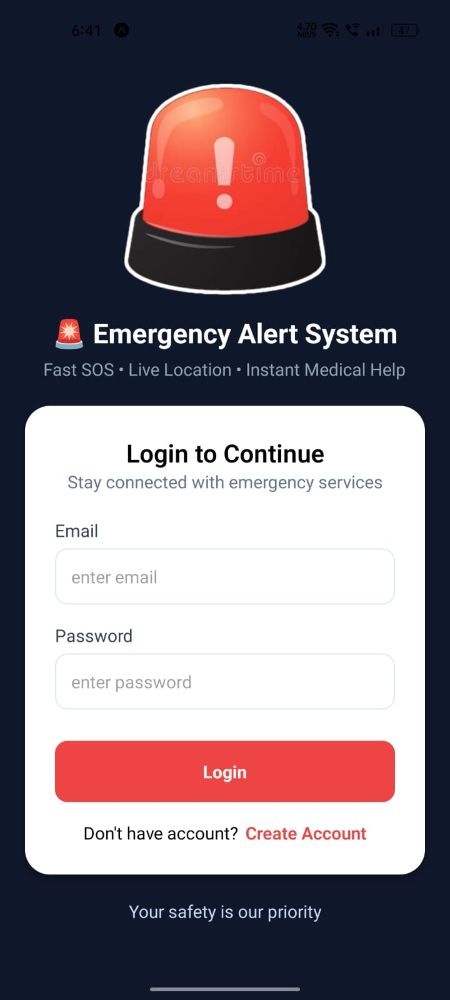
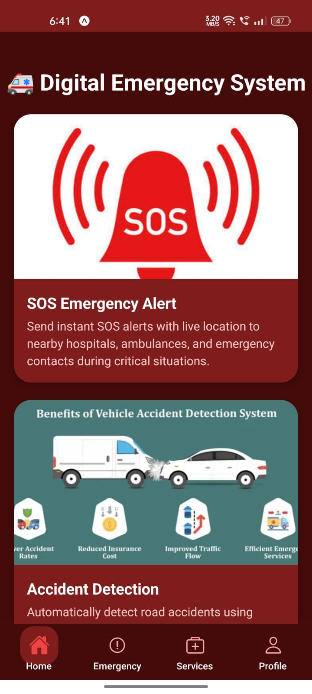
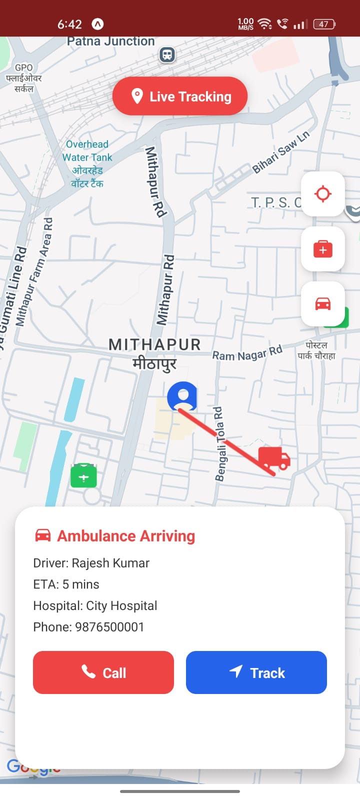
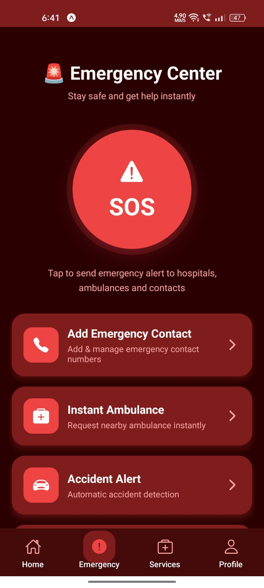
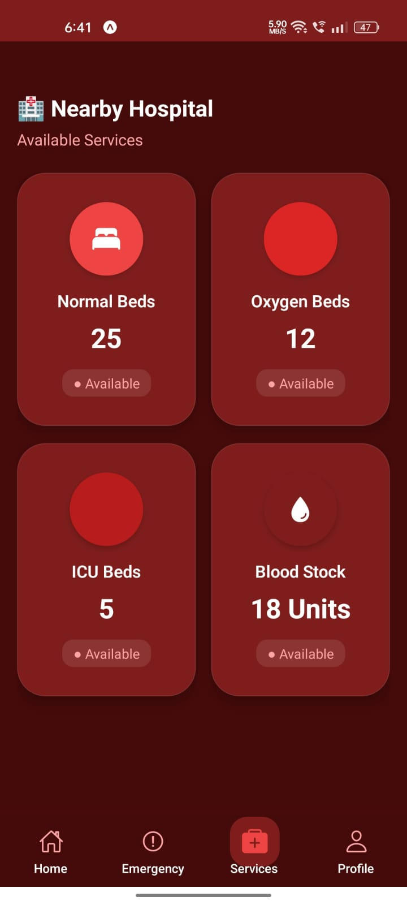
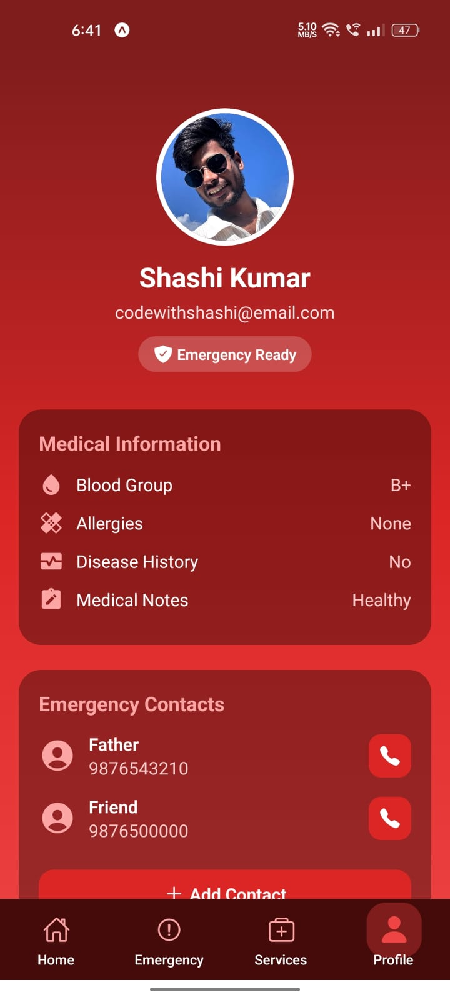

🚑 Intelligent Emergency Response & Accident Alert System

A smart real-time emergency platform that automatically detects accidents or SOS situations and instantly alerts hospitals, ambulances, and emergency contacts with live location and medical details.

This system is designed to reduce emergency response time and increase survival chances during critical situations.

📌 Problem Statement

In emergency situations, delays happen due to:

Late alerts to emergency services
Lack of accurate location tracking
Poor coordination between hospitals and ambulances
Victims unable to communicate
🎯 Goal

To build a smart emergency system that:

Detects accidents automatically
Sends instant SOS alerts
Shares real-time location
Notifies hospitals & emergency contacts
Improves coordination & response speed
🧠 Key Features
🚨 Emergency System
One-tap SOS Alert
Auto alert to hospitals & ambulances
Emergency contact notification
🚗 Accident Detection
Sensor-based detection (Accelerometer + Gyroscope)
Automatic SOS trigger
🗺️ Live Tracking
Real-time user location
Ambulance tracking with ETA
Fastest route navigation
🏥 Healthcare Integration
Nearby hospital finder
Hospital details & navigation
Emergency contact access
🚑 Smart Ambulance System
Live ambulance tracking
Driver details & ETA
Quick call option
👨‍👩‍👧 Emergency Contacts
Add family/friends
Auto alerts via SMS & WhatsApp
🩺 Medical Information
Blood group, allergies, disease history
Helps hospitals provide faster treatment
🎤 Voice SOS
Trigger SOS by saying: “Help”, “SOS”, “Emergency”
📷 Auto Recording
Automatic video capture during accidents
Evidence storage
📡 Offline Support
SMS alerts without internet
Shares last known location
🆕 Advanced Features
🩸 Blood Stock Availability
🛏️ Hospital Bed Availability
🫁 Oxygen Support Tracking
🏥 Real-time Hospital Resources
🛠️ Tech Stack
📱 Frontend
React Native (Expo)
Google Maps API
Sensors API
🌐 Backend
Node.js
Express.js
MongoDB
WebSocket (Real-time communication)
🔄 Automation
n8n
SMS API
WhatsApp API
Email API
🔄 System Flow
Accident Occurs
      ↓
Detected by Sensors
      ↓
SOS Triggered
      ↓
Location Sent
      ↓
Hospital & Ambulance Alerted
      ↓
Live Tracking Enabled
      ↓
Rescue Completed
📱 App Workflow
Splash → Onboarding → Login/Signup → OTP → Permissions
      ↓
Home Dashboard
      ↓
SOS / Driving Mode
      ↓
Accident Detection
      ↓
Emergency Alert
      ↓
Ambulance + Hospital Notification
      ↓
Live Tracking → Rescue
📁 Project Structure
src/
 ├── navigation/
 ├── screens/
 ├── components/
 ├── services/
 ├── store/
 └── utils/
🔌 Backend APIs
User
POST /api/register
POST /api/login
GET /api/profile
Emergency
POST /api/sos
POST /api/accident
GET /api/emergency/status
Hospital
GET /api/hospital/nearby
GET /api/hospital/details
🔄 Real-Time (WebSocket)
User connection
Ambulance connection
Hospital connection
SOS alerts
Live location updates
🔁 Automation Flow (n8n)
Accident → Backend Webhook → n8n →
SMS → WhatsApp → Email → Hospital Alert
🚀 Impact
⏱️ Faster emergency response
🏥 Better coordination between services
❤️ Life-saving solution

## 📱 Screenshots

  
  
  
  
  
  

